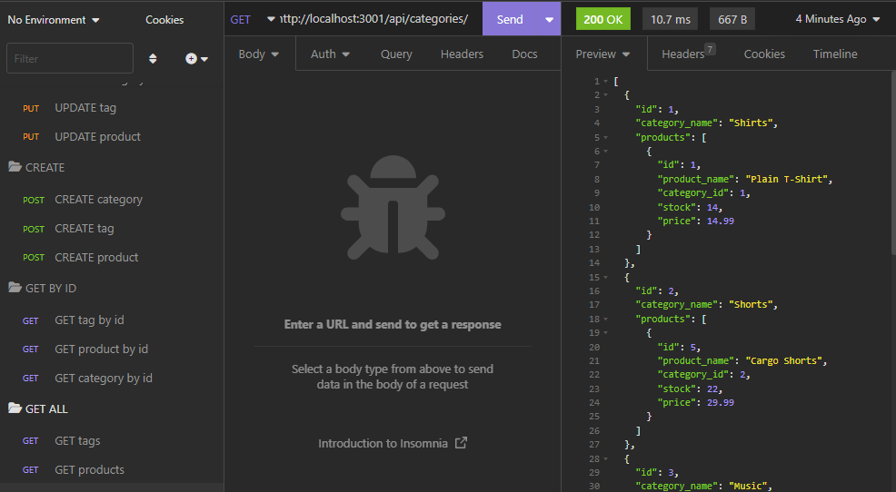

# **eshop-backend**

> This repository utilizes concepts within Object Relational Mapping (ORM) to create an ecommerce back-end server to handle GET, POST, PUT, and DELETE routes for various products, categories, and tags. 

## **Table of Contents**

- [**eshop-backend**](#eshop-backend)
  - [**Table of Contents**](#table-of-contents)
  - [**Features**](#features)
  - [**Installation**](#installation)
  - [**Usage Instructions**](#usage-instructions)
  - [Questions](#questions)
  - [Credits](#credits)

## **Features**
The deployed application and repository contains the following back-end features. This project focuses more on back-end structures, to which these features highlight:

- Model instances for categories, products, and tags to define properties that pass through, such as ID, name, etc.
- API routes that can take in a request body to pass objects and data into the appropriate routes, or request data.
- MySQL database schema and seeds to test objects in database environment for GET, POST, PUT, and DELETE routes.
- Server that connects MySQL data to Insomnia.

## **Installation**

Copy the HTTPS or SSH key into your terminal and perform a git pull to create a local copy of the repository. A copy of this repository can be cloned using either of the following codes in the terminal to create a copy in your local environment:

**HTTPS**: 
> `https://github.com/christiangella/eshop-backend.git`

**SSH**:
> `git@github.com:christiangella/eshop-backend.git`

## **Usage Instructions**

[Click here to view the live demonstration of the application](https://watch.screencastify.com/v/NHsyntA2Fcyb56yICwuM).

To deploy the application from your local environment, first clone a copy of the repository. Once the repository has been downloaded, navigate to the repository in the terminal and install the necessary third-party packages using `npm i`. 

First create the mySQL database in the command line terminal by running `mysql -u root -p`, making adjustments to root if the configuration is different. Enter the password if necessary, and log into mySQL. Then, after logging in, run `source ./db/schema.sql` to delete any existing instances of the database and create a new one. Afterwards, input `exit` to exit the mySQL shell.

In the command line terminal, seed the database using `npm seed` or `node ./seeds/index.js`. Afterwards, deploy the application locally by running either `npm start` or `node server.js`. This will deploy the repository to your local host at http://localhost:3001/. 

Open Insomnia and test to see if the data has been seeded by doing a GET Request at the following url: http://localhost:3001/api/categories/

GET requests can be made to `/api/categories`, `/api/tags`, and `/api/products`. By adding another slash (`/`), products can also be searched via ID.

POST requests can be made at any of these categories by seeding data into the request body.

PUT requests can be made by referencing an ID and seeding data into the request body.

DELETE requests can be made by referencing an ID.

## Questions

This repository was created by Manong Chris. For further support, reach out by email at christian.gella@gmail.com or by Github at christiangella.

## Credits

This repository was developed for the UC Davis Fullstacks Bootcamp under the UC Davis Continuing and Professional Education.
